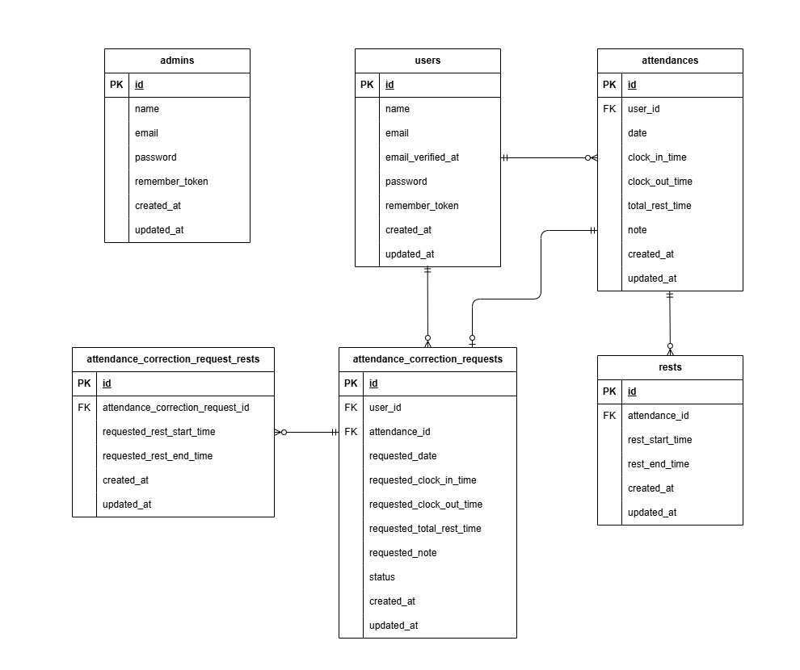

# 勤怠管理システム

## 環境構築

1.  Docker Desktop アプリケーションを起動します。
2.  プロジェクト直下で、以下のコマンドを実行します。

    ```bash
    make init
    ```

    ※`make init` 実行後、`.env` ファイルが作成されます。メール設定は、**手動で`.env`ファイルを編集して設定**してください。

## メール認証

開発環境でのメール確認には **Mailhog** を使用しています。
認証メールは以下のURLで確認できます。
http://localhost:8025

`.env` ファイルのメール設定は、以下のように設定してください。
``` text
MAIL_MAILER=smtp
MAIL_HOST=mailhog
MAIL_PORT=1025
MAIL_USERNAME=null
MAIL_PASSWORD=null
MAIL_ENCRYPTION=null
MAIL_FROM_ADDRESS="test@example.com"
MAIL_FROM_NAME="${APP_NAME}"
```

## テーブル仕様

### usersテーブル

| カラム名            | 型        | primary key | unique key | not null | foreign key |
| :------------------ | :-------- | :---------- | :--------- | :------- | :---------- |
| id                  | bigint    | ◯           |            | ◯        |             |
| name                | varchar(255) |            |            | ◯        |             |
| email               | varchar(255) |            | ◯          | ◯        |             |
| email_verified_at   | timestamp |            |            |          |             |
| password            | varchar(255) |            |            | ◯        |             |
| remember_token      | varchar(100) |            |            |          |             |
| created_at          | timestamp |            |            | ◯        |             |
| updated_at          | timestamp |            |            | ◯        |             |

### adminsテーブル

| カラム名       | 型        | primary key | unique key | not null | foreign key |
| :------------- | :-------- | :---------- | :--------- | :------- | :---------- |
| id             | bigint    | ◯           |            | ◯        |             |
| name           | varchar(255) |            |            | ◯        |             |
| email          | varchar(255) |            | ◯          | ◯        |             |
| password       | varchar(255) |            |            | ◯        |             |
| remember_token | varchar(100) |            |            |          |             |
| created_at     | timestamp |            |            | ◯        |             |
| updated_at     | timestamp |            |            | ◯        |             |

### attendancesテーブル

| カラム名          | 型        | primary key | unique key          | not null | foreign key |
| :---------------- | :-------- | :---------- | :------------------ | :------- | :---------- |
| id                | bigint    | ◯           |                     | ◯        |             |
| user_id           | bigint    |             | ◯ (dateとの組み合わせ) | ◯        | users(id)   |
| date              | date      |             | ◯ (user_idとの組み合わせ) | ◯        |             |
| clock_in_time     | timestamp |             |                     |          |             |
| clock_out_time    | timestamp |             |                     |          |             |
| total_rest_time   | time      |             |                     |          |             |
| note              | text      |             |                     |          |             |
| created_at        | timestamp |             |                     | ◯        |             |
| updated_at        | timestamp |             |                     | ◯        |             |

### restsテーブル

| カラム名          | 型        | primary key | unique key | not null | foreign key |
| :---------------- | :-------- | :---------- | :--------- | :------- | :---------- |
| id                | bigint    | ◯           |            | ◯        |             |
| attendance_id     | bigint    |             |            | ◯        | attendances(id) |
| rest_start_time   | timestamp |             |            | ◯        |             |
| rest_end_time     | timestamp |             |            |          |             |
| created_at        | timestamp |             |            | ◯        |             |
| updated_at        | timestamp |             |            | ◯        |             |

### attendance_correction_requestsテーブル

| カラム名                | 型        | primary key | unique key | not null | foreign key |
| :---------------------- | :-------- | :---------- | :--------- | :------- | :---------- |
| id                      | bigint    | ◯           |            | ◯        |             |
| user_id                 | bigint    |             |            | ◯        | users(id)   |
| attendance_id           | bigint    |             |            | ◯        | attendances(id) |
| requested_date          | date      |             |            | ◯        |             |
| requested_clock_in_time | timestamp |             |            |          |             |
| requested_clock_out_time | timestamp |             |            |          |             |
| requested_total_rest_time | time      |             |            |          |             |
| requested_note          | text      |             |            | ◯        |             |
| status                  | varchar(50) |            |            | ◯        |             |
| created_at              | timestamp |             |            | ◯        |             |
| updated_at              | timestamp |             |            | ◯        |             |

### attendance_correction_request_restsテーブル

| カラム名                        | 型        | primary key | unique key | not null | foreign key |
| :------------------------------ | :-------- | :---------- | :--------- | :------- | :---------- |
| id                              | bigint    | ◯           |            | ◯        |             |
| attendance_correction_request_id | bigint    |             |            | ◯        | attendance_correction_requests(id) |
| requested_rest_start_time       | timestamp |             |            | ◯        |             |
| requested_rest_end_time         | timestamp |             |            | ◯        |             |
| created_at                      | timestamp |             |            | ◯        |             |
| updated_at                      | timestamp |             |            | ◯        |             |

## ER図


## テストアカウント

**一般ユーザー**
* name: 一般ユーザー1
* email: general1@example.com
* password: password
-------------------------
* name: 一般ユーザー2
* email: general2@example.com
* password: password
-------------------------
**管理者ユーザー**
* name: 管理者ユーザー1
* email: admin1@example.com
* password: password
-------------------------
* name: 管理者ユーザー2
* email: admin2@example.com
* password: password
-------------------------

## PHPUnitを利用したテストに関して
以下のコマンド:  
```
//テスト用データベースの作成
docker-compose exec mysql bash
mysql -u root -p
//パスワードはrootと入力
create database test_database;

docker-compose exec php bash
php artisan migrate:fresh --env=testing
./vendor/bin/phpunit
```

## 追加機能・変更点（機能要件との差異、運営からのフィードバックを含む）

本プロジェクトでは、基本の機能要件に加えて以下の変更・追加対応を行いました。

* **管理者のログアウト後の画面遷移を、管理者のログイン画面に設定しています。** (指定がなかったため、この挙動としました。コーチより許可いただきました。)
* **申請一覧画面の申請理由が、長文の場合は省略して表示しています。** (指定されていたUIを保つため。)
* **メール認証のメール再送時と、管理者での勤怠情報修正時に、メッセージを表示するようにしました。** (画面遷移がなく、実際に機能したかがわかりづらかったため。)
* **テストケースのID7のテスト内容をまとめました。** (「休憩は一日に何回でもできる」と「休憩戻は一日に何回でもできる」の内容がほとんど同じであったため、1つのテストに統合し、合計4つのテストが実行されます。)
* **テストケースのID11のテストファイルを分割しました。** (`UserAttendanceCorrectionTest.php` と `AttendanceCorrectionRequestTest.php` に分けています。)
* **テストケースID11およびID13におけるバリデーションメッセージの変更。** 運営より回答あり。ユーザーおよび管理者による勤怠情報修正時、休憩時間が勤務時間外となる場合の期待挙動のバリデーションメッセージを、機能要件に合わせて「**休憩時間が勤務時間外です**」に変更しました。（元々の「休憩時間が不適切な値です」や「出勤時間もしくは退勤時間が不適切な値です」から変更）
    * **変更例（ID11、ID13共通）:**
        * 休憩開始時間が退勤時間より後になっている場合のエラーメッセージ: 「休憩時間が勤務時間外です」
        * 休憩終了時間が退勤時間より後になっている場合のエラーメッセージ: 「休憩時間が勤務時間外です」


## 使用技術(実行環境)
- PHP 7.4.9
- Laravel8.83.8
- MySQL8.0.26

## URL
- 開発環境：http://localhost/
- phpMyAdmin:：http://localhost:8080/
